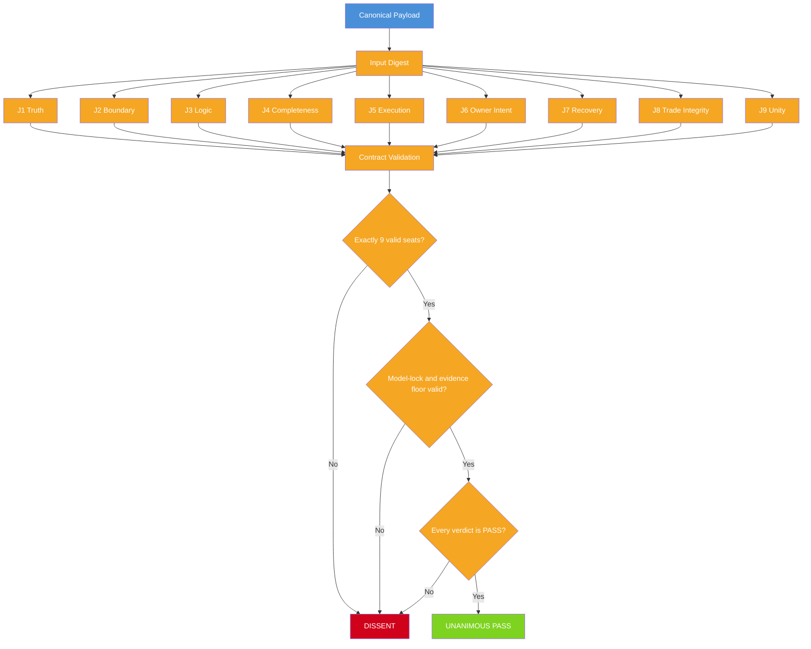
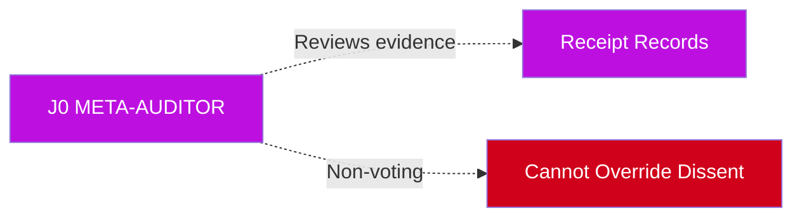

# Action Gate Flow

> **Status:** IMPLEMENTED IN ALPHA

## Visual Flow

## J0 Meta-Auditor

**J0 is non-voting.** It reviews the judges and receipt evidence but cannot approve an action by itself. It cannot override a dissent.

## Accessible Text Description

A canonical payload is hashed to create an input digest. The digest is reviewed by nine judges (J1-J9). Each judge validates the contract. The system checks: exactly 9 valid seats? Model-lock and evidence floor valid? Every verdict PASS? If all checks pass, the action is unanimously approved. If any check fails, the action is refused.

## Validation Checks

| Check | Description |
|-------|-------------|
| **Exactly 9 seats** | No more, no less |
| **No duplicates** | Each judge ID must be unique |
| **No unknown IDs** | Only J1-J9 accepted |
| **Model-lock** | Judge must use assigned model (if configured) |
| **Evidence floor** | At least 2 tool calls per judge |
| **Unanimous PASS** | All 9 must return PASS |

## What Happens on Dissent

1. A DISSENT receipt is produced
2. The action is **not** executed
3. The receipt is persisted for audit
4. The caller receives the refusal reason
