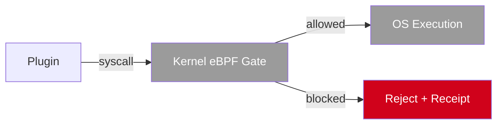

# Plugin Boundary

> **Status:** IMPLEMENTED IN ALPHA (manifest check)
> **Future:** OS-level enforcement (not in v0.1)

## Visual Boundary

## Accessible Text Description

A plugin makes a request. The system checks the plugin's manifest to see if the capability is declared. If not declared, the request is rejected and a receipt is produced. If declared, a dry-run canonical payload is created and sent to `JudgeGate.verify_action`. If the gate returns dissent, the request is rejected. If the gate passes, the capability adapter executes the action and produces a result receipt.

## Boundary Labels (Red = Restricted)

| Boundary | Status | Description |
|----------|--------|-------------|
| **Network access** | Declared in manifest | Plugin must declare network access |
| **Subprocess execution** | Declared in manifest | Plugin must declare subprocess use |
| **Filesystem write** | Declared in manifest | Plugin must declare write access |
| **Credentials** | Declared in manifest | Plugin must declare credential use |
| **External APIs** | Declared in manifest | Plugin must declare API access |
| **Mail/money/messaging** | Declared in manifest | Plugin must declare sensitive actions |

## Important Distinction

**A manifest is not OS enforcement.** It declares intent. The adapter and platform boundary must enforce it. Future versions may add kernel-level enforcement (see "Proposed Future Architecture" below).

## Proposed Future Architecture

> **Status:** PROPOSED FUTURE ARCHITECTURE
> Current v0.1 does not provide kernel-level enforcement.
