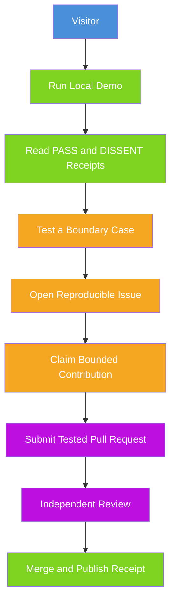

# Public Contribution Flow

> **Status:** IMPLEMENTED IN ALPHA

## Visual Flow

## Accessible Text Description

A visitor runs the local demo. They read PASS and DISSENT receipts to understand the system. They test a boundary case. They open a reproducible issue. They claim a bounded contribution. They submit a tested pull request. The request is independently reviewed. On merge, a receipt is published.

## Public Call to Action

| Action | Description |
|--------|-------------|
| **RUN** | Reproduce the local gate |
| **TEST** | Try to find a bypass |
| **BUILD** | Submit a bounded, tested improvement |

## Contribution Ladder

1. **Docs** — Improve setup docs for Windows or Linux
2. **Plugins** — Add a safe, no-network studio
3. **Gate/Receipts** — Contracts, roster validation, evidence, replay
4. **Security review** — Threat modeling, tamper tests, policy review

## Incentives

- Security-researcher bounties for verified gate escapes
- Contributor credits and public acknowledgments
- Sponsored pilot integrations for startups
- Grants or paid contracts for building judges, replay fixtures, observability

**No rewards for:** raw traffic volume, unanimous PASS rates, or suppressed dissent.
