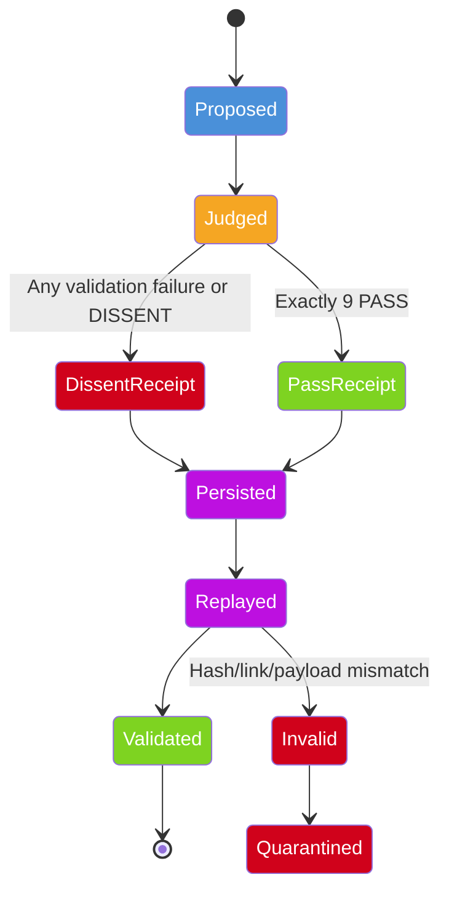

# Receipt Lifecycle

> **Status:** PARTIALLY IMPLEMENTED — see the field table below for what
> exists today vs. what is planned. The replay flow (Persisted → Replayed →
> Validated) is NOT yet implemented: ReceiptChain verifies in-memory chains,
> and JudgeGate loads and verifies a persisted chain at construction time,
> but there is no standalone replay API.

## Visual Lifecycle



## Receipt Structure

Every receipt contains:

## Field table — ACTUAL schema (amartie/receipt.py, amartie/gate.py)

| Field | Status | Description |
|-------|--------|-------------|
| `action_id` | implemented | The action being reviewed (UUID) |
| `action_type` | implemented | Type of action (email.send, tool.call, etc.) |
| `contract_version` | implemented | Version of the judge contract |
| `payload_hash` | implemented | SHA-256 hash of the action payload |
| `verdicts` | implemented | Per-judge records: judge_id, model_id, verdict, findings, corrections, tool_calls, rationale, timestamp |
| `metadata` | implemented | Gate context: roster_valid, roster_reason, executed |
| `previous_hash` | implemented | Hash of the previous receipt in the chain (GENESIS for the first) |
| `hash` | implemented | SHA-256 over all fields above |
| `timestamp` | implemented | When the receipt was created (UTC) |
| `receipt_id` | NOT implemented | planned — `action_id` serves this role today |
| `payload_digest` | NOT implemented | planned — named `payload_hash` today |
| `judge_roster` | NOT implemented | planned — derivable from `verdicts[].judge_id` |
| `judge_decision` | NOT implemented | planned — per-judge verdict inside `verdicts[]` |
| `executed` (top-level) | NOT implemented | planned — lives inside `metadata.executed` today |

## Dissent Receipt Example (actual serialized output)

```json
{
  "action_id": "5a96c0b5-1f73-46d7-843d-76f8e53933f3",
  "action_type": "email.send",
  "payload_hash": "59672d2948aecafc11f8c37637082ee2a14ac660059cc89477127c20f3b55909",
  "verdicts": [
    {
      "judge_id": "J1",
      "model_id": "m1",
      "verdict": "PASS",
      "findings": [],
      "corrections": [],
      "tool_calls": [
        "a",
        "b"
      ],
      "rationale": "ok",
      "timestamp": "2026-09-20T20:16:35.843727+00:00"
    },
    {
      "judge_id": "J2",
      "model_id": "m1",
      "verdict": "PASS",
      "findings": [],
      "corrections": [],
      "tool_calls": [
        "a",
        "b"
      ],
      "rationale": "ok",
      "timestamp": "2026-09-20T20:16:35.843740+00:00"
    },
    {
      "judge_id": "J3",
      "model_id": "m1",
      "verdict": "DISSENT",
      "findings": [],
      "corrections": [],
      "tool_calls": [
        "a",
        "b"
      ],
      "rationale": "ok",
      "timestamp": "2026-09-20T20:16:35.843745+00:00"
    },
    {
      "judge_id": "J4",
      "model_id": "m1",
      "verdict": "PASS",
      "findings": [],
      "corrections": [],
      "tool_calls": [
        "a",
        "b"
      ],
      "rationale": "ok",
      "timestamp": "2026-09-20T20:16:35.843766+00:00"
    },
    {
      "judge_id": "J5",
      "model_id": "m1",
      "verdict": "PASS",
      "findings": [],
      "corrections": [],
      "tool_calls": [
        "a",
        "b"
      ],
      "rationale": "ok",
      "timestamp": "2026-09-20T20:16:35.843769+00:00"
    },
    {
      "judge_id": "J6",
      "model_id": "m1",
      "verdict": "PASS",
      "findings": [],
      "corrections": [],
      "tool_calls": [
        "a",
        "b"
      ],
      "rationale": "ok",
      "timestamp": "2026-09-20T20:16:35.843772+00:00"
    },
    {
      "judge_id": "J7",
      "model_id": "m1",
      "verdict": "PASS",
      "findings": [],
      "corrections": [],
      "tool_calls": [
        "a",
        "b"
      ],
      "rationale": "ok",
      "timestamp": "2026-09-20T20:16:35.843792+00:00"
    },
    {
      "judge_id": "J8",
      "model_id": "m1",
      "verdict": "PASS",
      "findings": [],
      "corrections": [],
      "tool_calls": [
        "a",
        "b"
      ],
      "rationale": "ok",
      "timestamp": "2026-09-20T20:16:35.843795+00:00"
    },
    {
      "judge_id": "J9",
      "model_id": "m1",
      "verdict": "PASS",
      "findings": [],
      "corrections": [],
      "tool_calls": [
        "a",
        "b"
      ],
      "rationale": "ok",
      "timestamp": "2026-09-20T20:16:35.843802+00:00"
    }
  ],
  "previous_hash": "GENESIS",
  "metadata": {
    "roster_valid": true,
    "roster_reason": "Roster valid",
    "executed": false
  },
  "contract_version": "amartie-judge-contract-v1",
  "hash_algorithm": "sha256",
  "timestamp": "2026-09-20T20:16:35.843917+00:00",
  "hash": "d54a0a9919b3dd715287e14aa70581b4e27d3cc3ed55452ea2a7e942e751f72a"
}
```

Note: `metadata.executed` is `false` — a dissent receipt must never claim
the action ran. `metadata.roster_reason` carries the machine-readable
roster verdict.

**Critical:** A dissent receipt explicitly states `"metadata.executed": false`. A receipt must never claim that an action occurred when the gate denied it.

## Accessible Text Description

An action is proposed and then judged. If any judge dissents or validation fails, a DISSENT receipt is produced. If all 9 judges pass, a PASS receipt is produced. Both types are persisted. When replayed, the system validates the hash chain. If valid, the receipt is confirmed. If invalid (hash mismatch, tampering), the receipt is quarantined for investigation.
