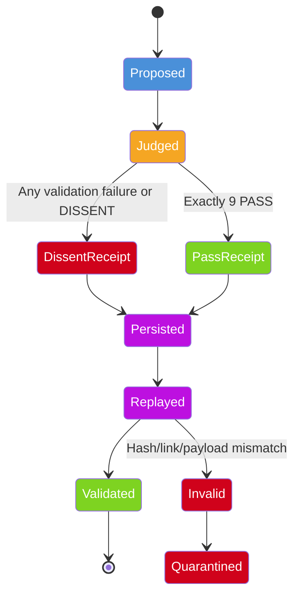

# Receipt Lifecycle

> **Status:** IMPLEMENTED IN ALPHA

## Visual Lifecycle



## Receipt Structure

Every receipt contains:

| Field | Description |
|-------|-------------|
| `receipt_id` | Unique identifier for this receipt |
| `action_id` | The action being reviewed |
| `action_type` | Type of action (email.send, tool.call, etc.) |
| `contract_version` | Version of the judge contract |
| `payload_digest` | SHA-256 hash of the action payload |
| `judge_roster` | List of all 9 judge IDs |
| `judge_model` | Model/version used by each judge |
| `judge_decision` | PASS or DISSENT per judge |
| `judge_rationale` | Evidence and reasoning per judge |
| `executed` | `true` if action was allowed, `false` if refused |
| `previous_receipt_hash` | Hash of the previous receipt in the chain |
| `receipt_hash` | SHA-256 hash of this entire receipt |
| `timestamp` | When the receipt was created (UTC) |

## Dissent Receipt Example

```json
{
  "decision": "DISSENT",
  "allowed": false,
  "executed": false,
  "execution_status": "NOT_EXECUTED",
  "receipt_id": "r-abc123",
  "action_id": "a-xyz789",
  "action_type": "email.send",
  "contract_version": "amartie-judge-contract-v1",
  "payload_digest": "sha256:def456...",
  "judge_roster": ["J1","J2","J3","J4","J5","J6","J7","J8","J9"],
  "judge_decisions": {
    "J1": "PASS",
    "J2": "PASS",
    "J3": "DISSENT",
    "J4": "PASS",
    "J5": "PASS",
    "J6": "PASS",
    "J7": "PASS",
    "J8": "PASS",
    "J9": "PASS"
  },
  "executed": false,
  "previous_receipt_hash": "sha256:aaa111...",
  "receipt_hash": "sha256:bbb222...",
  "timestamp": "2026-09-18T12:00:00Z"
}
```

**Critical:** A dissent receipt explicitly states `"executed": false`. A receipt must never claim that an action occurred when the gate denied it.

## Accessible Text Description

An action is proposed and then judged. If any judge dissents or validation fails, a DISSENT receipt is produced. If all 9 judges pass, a PASS receipt is produced. Both types are persisted. When replayed, the system validates the hash chain. If valid, the receipt is confirmed. If invalid (hash mismatch, tampering), the receipt is quarantined for investigation.
