# System Overview

> **Status:** IMPLEMENTED IN ALPHA

## Visual Overview

```mermaid
flowchart LR
    U["Owner / User Intent"] --> S["Studio or Plugin"]
    S --> P["Canonical Action Payload"]
    P --> J["Nine-Judge Review"]
    J --> V{"All 9 PASS?"}

    V -->|"No: DISSENT"| D["Refusal Receipt"]
    D --> X["No External or Hidden Execution"]

    V -->|"Yes"| G["JudgeGate.verify_action"]
    G --> R["PASS Receipt"]
    R --> E["Approved Adapter / Tool Execution"]
    E --> O["Observed Result"]
    O --> A["Audit and Replay"]

    style U fill:#4A90D9,color:#fff
    style S fill:#4A90D9,color:#fff
    style P fill:#F5A623,color:#fff
    style J fill:#F5A623,color:#fff
    style V fill:#F5A623,color:#fff
    style G fill:#F5A623,color:#fff
    style D fill:#D0021B,color:#fff
    style X fill:#D0021B,color:#fff
    style R fill:#7ED321,color:#fff
    style E fill:#7ED321,color:#fff
    style A fill:#BD10E0,color:#fff
```

## Accessible Text Description

The user or plugin creates an action. The action is turned into a canonical (standardized) payload. That payload is reviewed by nine independent judges. If all nine judges return PASS, the action is approved and a PASS receipt is produced. If any judge returns DISSENT, the action is refused and a DISSENT receipt is produced. A refused action is **never** executed.

## Legend

| Color | Meaning |
|-------|---------|
| **BLUE** | User or plugin input |
| **GOLD** | AMARTIE validation/control |
| **GREEN** | Unanimous approval |
| **RED** | Dissent, rejection, or quarantine |
| **PURPLE** | Audit, replay, or evidence |
| **GRAY** | Future capability (not in v0.1) |

## What This Diagram Shows

- **Solid arrows** = Implemented data path in v0.1
- **Dashed arrows** = Proposed/future path (not implemented)
- **Lock icon** = Enforced boundary
- **Document icon** = Receipt or evidence artifact

## Key Invariants

1. Every action must pass through `JudgeGate.verify_action` before execution
2. No direct path from plugin to provider — the gate is always in between
3. A DISSENT receipt proves the action was **not** executed
4. A PASS receipt proves the action was reviewed and approved
